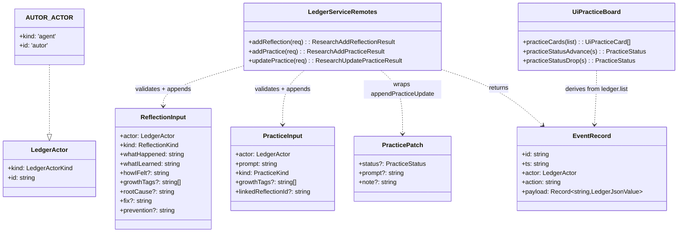

# Mimir Ledger 人本化具象化 — 增量架构设计

> 分支：`feat/humanized-ledger`（在现有 WIP 之上增量扩展，不覆盖）
> 作者：高见远（架构师）
> 范围：让 Ledger 把 autoresearch 自主研究循环以更人本、更实践化、更具象的方式呈现——反思的自反性接线、从失败自动生成可动手的实践卡、可操作的实践看板 + 人本入口。
> 铁律（沿用 ledger.ts 头部约定）：`events` 表是单一事实源；只记决策级事件；写先于业务 ack、调用点 best-effort（失败只 warn 不阻断业务）；v1 约定 append-only；payload 上限 `EVENT_PAYLOAD_MAX_CHARS=2048` 字符（`LedgerJsonValue` 约束，跨 Remote 边界必须是 JSON 值）。

---

## 1. 改动动机

当前 Ledger 已实现人本层数据模型（`reflection.record` / `practice.create` / `practice.update` 事件、`ReflectionInput`/`PracticeInput`/`PracticePatch`、`practiceBoardOf`、`growthDimensionsOf`、`humanGrowthLetter`），但**接线极度不对称**：

- 机器轨迹已广泛记录（experiment / paper / library / server / wiki-admin / wiki 工具都在发射 `emitEvent`）。
- 人本事件**仅在 `review.ts` 一步**自动发射（reviewer 子代理写一条 insight/mistake 反思）。
- 实践卡（practice.create）**全代码库没有任何自动发射点**——"实践清单"只在报告里作为静态段落存在，UI 里也不是可操作的看板。

目标三块（均已在仓库侦察中确认事实）：

- **A. 反思的自反性接线**：在 autoresearch 循环的其他"人本决策时刻"自动落地反思（idea 方向选定、paper 编译成功/失败）。
- **B. 从循环失败自动生成实践卡**：把 Ledger 从"记录"变成"给出可动手的下一步"（review FAIL、paper 编译 FAIL 各自动 emitPractice 一张卡）。
- **C. 可操作的实践看板 UI + 人本入口**：独立实践看板面板（状态翻转按钮）、"记一笔反思"/"加一张实践卡"人本入口，对应新增写 Remote（`addReflection` / `addPractice` / `updatePractice`）。

---

## 2. 关键设计决策与结论

### 2.1 新增 actor：`AUTOR_ACTOR`（结论）

**结论：引入新常量 `AUTOR_ACTOR = Object.freeze({ kind: 'agent', id: 'autor' })`，用于所有"自主研究循环代研究者书写"的本真人本事件；用户亲手书写的反思/实践卡使用既有 `PANEL_ACTOR`（`{kind:'user', id:'panel'}`）。**

理由：
1. 类型注释示例 `LedgerActor.id` 已预留 `'autor'`（types.ts 注释 `"e.g. panel, wiki_note, reviewer, autor, service"`），沿用既有命名无需新增 actor 种类（仍为 `'agent'`）。
2. 让 `actorKind` 过滤器有意义：可区分"自主循环写了什么（`agent/autor`）" vs "人在面板写了什么（`user/panel`）" vs "独立评审员写了什么（`subagent/reviewer`）"。
3. `review.ts` 既有反思保留 `REVIEWER_ACTOR`（那是真正的独立评审员，不是循环本身）；由 review 失败**派生**的实践卡归 `AUTOR_ACTOR`（循环把评审结论转成了可行动项）。
4. 不污染 `WIKI_AGENT_ACTOR`（`wiki_note` 工具写）、`SERVICE_ACTOR`（host 生命周期）。

### 2.2 编译反思/实践卡的接线点（结论：双发射点，互斥路径）

`paper` 编译事件有两处发射点，二者是**互斥的调用路径**，不会重复计数：
- **服务路径**：`services/paper.ts` 的 `compile()`——面板"编译"按钮走的 `research.compile` Remote，已在此发射 `writing.compile.settled`，且上下文最完整（outcome、projectId、refs）。**就近加**（符合任务提示"paper.ts 已有编译发射点"）。
- **工具路径**：`tools/latex.ts` 的 `createLatexCompileTool`——autoresearch 循环（`paper-write` 指令第 5 步 `Run latex_compile`）真正编译走的是这个**工具**，它目前不发射任何账本事件、也没有 domain 句柄。

为覆盖整个 autoresearch 循环，两处都接：抽一个共享 helper `emitCompileOutcome(domain, opts)`（在 `ledger.ts`），成功→insight 反思；失败→struggle 反思 + 一张 method 实践卡（linkedReflectionId 指向刚写的反思）。服务路径与工具路径各调用一次，因互斥不会双写。

> 工具签名需扩展：`createLatexCompileTool(options: LatexToolOptions, domain: ResearchWikiDomain)`。这是唯一一处非纯工具改造，但 `wiki_note` 等工具已持有 domain，属既有先例。

### 2.3 实践卡 actor 与 growthTags 约定

- review FAIL 派生卡：`actor: AUTOR_ACTOR`，`kind: 'method'`，`prompt` 由 `round.issues` 派生（取前 1–2 条 `location: problem`，截断到安全长度），`growthTags: ['peer-review', 'rigor']`，`linkedReflectionId` → 刚写的反思 id。
- paper 编译 FAIL 派生卡：`actor: AUTOR_ACTOR`，`kind: 'method'`，`prompt: '修复编译错误（见最近一条编译失败反思）'`，`growthTags: ['writing', 'latex']`，`linkedReflectionId` → 刚写的 struggle 反思 id。
- 人写在面板：`actor: PANEL_ACTOR`，kind/growthTags 由用户填。

### 2.4 新增写 Remote 的语义

现有账本 Remote 只有**只读**（`listEvents` / `generateProgressReport`）；所有写入都是调用点的 `emit*`（best-effort，失败 warn 吞掉）。本次新增的 3 个 Remote（`addReflection` / `addPractice` / `updatePractice`）是**唯一的人本写入口**——它们是用户/面板显式提交，因此：
- **服务端强校验**输入（kind/status 非法 → `invalid-input`），而非静默忽略；
- **actor 在服务端固定为 `PANEL_ACTOR`**（人本入口必然是"人"写的，避免客户端伪造 actor）；
- 用 `append*`（返回 `EventRecord`）而非 `emit*`（void），校验通过即持久化；存储异常 catch 后返回 `rejected({ code: 'invalid-input', message })`，UI 以 toast 呈现失败。

---

## 3. 文件清单与相对路径

### 后端（packages/mimir）

| 文件 | 改动性质 |
|---|---|
| `packages/mimir/src/types.ts` | 新增 3 个结果类型 `ResearchAddReflectionResult`/`ResearchAddPracticeResult`/`ResearchUpdatePracticeResult`；在 `export type {...} from './types.ts'` 块中导出（供 `dsh-mimir/types` 面使用） |
| `packages/mimir/src/ledger.ts` | 新增 `AUTOR_ACTOR` 常量；新增共享 helper `emitCompileOutcome`；复用既有 `emitReflection`/`emitPractice`/`appendReflection`/`appendPracticeUpdate` |
| `packages/mimir/src/services/ledger.ts` | 新增域函数 `addReflectionRemote` / `addPracticeRemote` / `updatePracticeRemote`（校验 + append + 返回 `{event}`） |
| `packages/mimir/src/service.ts` | 在 `ResearchService` 注册 3 个 `@Remote` 方法（`addReflection`/`addPractice`/`updatePractice`），转发到域函数 |
| `packages/mimir/src/index.ts` | 导出 `AUTOR_ACTOR` 与新结果类型；（可选）导出新域函数 |
| `packages/mimir/src/commands/idea.ts` | `createProject` 后 `emitReflection` 一条 `decision`（AUTOR_ACTOR） |
| `packages/mimir/src/commands/review.ts` | 把既有 `emitReflection` 改为捕获 id 的 `appendReflection`；`round.verdict==='FAIL'` 时 `emitPractice` 一张 method 卡（linkedReflectionId） |
| `packages/mimir/src/services/paper.ts` | `compile()` 在既有 `emitEvent('writing.compile.settled')` 之后调用 `emitCompileOutcome` |
| `packages/mimir/src/tools/latex.ts` | `createLatexCompileTool(options, domain)` 扩展；`execute` 中 `compileLatex` 后调用 `emitCompileOutcome` |
| `packages/mimir/tests/ledger.spec.ts` | 扩展：覆盖 3 个写 Remote、idea decision 反思、`emitCompileOutcome`、review 自动实践卡、AUTOR_ACTOR |

### 前端（packages/ui-mimir）

| 文件 | 改动性质 |
|---|---|
| `packages/ui-mimir/src/client/controller.ts` | `ResearchRemote` 增加 `addReflection`/`addPractice`/`updatePractice` 签名；新增 3 个 controller 方法（调用 Remote → 重载台账 `loadLedger` → toast） |
| `packages/ui-mimir/src/client/ledger-view.ts` | 新增纯函数 `practiceStatusAdvance(status)` / `practiceStatusDrop(status)`（看板状态机）；复用既有 `practiceCards`/`UiPracticeCard` |
| `packages/ui-mimir/src/client/LedgerView.tsx` | 新增独立"实践看板"段落（从 `ledger.list` 经 `practiceCards` 派生）+ 状态翻转按钮 + "记一笔反思/加一张实践卡"人本内联表单 |
| `packages/ui-mimir/src/client/locales.ts` | `zh`/`en` 字典各增加 ledger 人本段文案（见 §4.4） |
| `packages/ui-mimir/src/client/ResearchPanel.module.css` | 新增看板/卡片/内联表单样式（复用 `.btn`/`.tagPill`/`.growthChip`/`.reflectionBadge`/`.practiceBadge`） |
| `packages/ui-mimir/tests/ledger-view.spec.ts` | 扩展：`practiceCards` 解析新事件、`practiceStatusAdvance` 状态机 |
| `packages/ui-mimir/tests/controller.client.spec.ts` | 扩展：3 个写动词 + 重载 + toast |

---

## 4. 数据结构 / 接口变更（含新增 Remote 请求/响应草图）

### 4.1 类型与常量（types.ts / ledger.ts）

```ts
// ledger.ts —— 新增 actor 常量
export const AUTOR_ACTOR: LedgerActor = Object.freeze({ kind: 'agent', id: 'autor' })

// types.ts —— 新增 3 个结果类型（供 dsh-mimir/types 面导出）
export type ResearchAddReflectionResult = ResearchResult<{ readonly event: EventRecord }>
export type ResearchAddPracticeResult   = ResearchResult<{ readonly event: EventRecord }>
export type ResearchUpdatePracticeResult = ResearchResult<{ readonly event: EventRecord }>
```

### 4.2 新增 Remote 请求/响应形状（草图）

```ts
// addReflection —— 人本入口，actor 服务端固定为 PANEL_ACTOR
@Remote('addReflection')
addReflection(request: {
  kind: string                                   // 校验 ∈ ReflectionKind
  whatHappened: string
  whatILearned: string
  howIFelt?: string | undefined
  wouldDoDifferently?: string | undefined
  growthTags?: string[] | undefined
  linkedAction?: string | undefined
  rootCause?: string | undefined                // kind==='mistake' 时建议
  fix?: string | undefined
  prevention?: string | undefined
  projectId?: string | undefined                // → refs
}): Promise<ResearchAddReflectionResult>         // { ok:true, value:{ event } } | rejected

// addPractice —— 人本入口，actor 服务端固定为 PANEL_ACTOR
@Remote('addPractice')
addPractice(request: {
  prompt: string                                // 非空
  kind: string                                  // 校验 ∈ PracticeKind
  rationale?: string | undefined
  growthTags?: string[] | undefined
  linkedReflectionId?: string | undefined
  dueAt?: string | undefined
  projectId?: string | undefined
}): Promise<ResearchAddPracticeResult>

// updatePractice —— 包装 appendPracticeUpdate，actor 服务端固定为 PANEL_ACTOR
@Remote('updatePractice')
updatePractice(request: {
  id: string
  patch: { status?: string; prompt?: string; note?: string }   // status 校验 ∈ PracticeStatus
}): Promise<ResearchUpdatePracticeResult>
```

> 跨 Remote 边界的 payload 全部为 `LedgerJsonValue`（字符串/字符串数组等 JSON 值），符合要求。

### 4.3 共享 helper（ledger.ts）

```ts
/** 编译结果的人本化：成功→insight 反思；失败→struggle 反思 + method 实践卡。
 *  best-effort：任一写入失败仅 warn。返回刚写的反思 id（供调用方可选地 link）。 */
export async function emitCompileOutcome(
  domain: ResearchWikiDomain,
  opts: {
    readonly projectId?: string | undefined
    readonly success: boolean
    readonly issueCount: number
    readonly actor?: LedgerActor                                // 默认 AUTOR_ACTOR
    readonly now?: Date | undefined
  },
): Promise<string | undefined>
```

### 4.4 前端 locales 新增键（zh + en 成对）

| 键 | zh | en |
|---|---|---|
| `ledger.practiceBoard` | 实践看板 | Practice board |
| `ledger.practiceBoard.empty` | 还没有实践卡——评审/编译失败会自动生成，也可以亲手加一张 | No practice cards yet — failures auto-generate one, or add your own |
| `ledger.practice.add` | 加一张实践卡 | Add a practice card |
| `ledger.practice.addPromptPlaceholder` | 这周要动手做的一件事… | One thing to actually do this week… |
| `ledger.practice.kind` | 类型 | Kind |
| `ledger.practice.growthTags` | 成长标签 | Growth tags |
| `ledger.practice.linked` | 关联反思 | Linked reflection |
| `ledger.practice.advance` | 推进 | Advance |
| `ledger.practice.drop` | 搁置 | Drop |
| `ledger.practice.reopen` | 重开 | Reopen |
| `ledger.reflection.add` | 记一笔反思 | Add a reflection |
| `ledger.reflection.whatHappened` | 发生了什么 | What happened |
| `ledger.reflection.whatILearned` | 学到了什么 | What I learned |
| `ledger.reflection.howIFelt` | 感受（可选） | How I felt (optional) |
| `ledger.reflection.submit` | 保存 | Save |
| `ledger.reflection.cancel` | 取消 | Cancel |
| `ledger.addReflection.done` | 反思已记录 | Reflection saved |
| `ledger.addPractice.done` | 实践卡已添加 | Practice card added |
| `ledger.updatePractice.done` | 实践状态已更新 | Practice updated |
| `ledger.write.failed` | 保存失败 | Could not save |

### 4.5 类图（新增面）



---

## 5. 调用流程图（时序要点）

```mermaid
sequenceDiagram
    autonumber
    participant Loop as autoresearch 循环
    participant Tool as latex_compile 工具 / paper.compile 服务
    participant Ledger as ledger.ts (emitCompileOutcome)
    participant Domain as wiki events 表

    Note over Loop,Tool: 路径一：工具（循环编译）/ 路径二：服务（面板编译），互斥
    Loop->>Tool: compileLatex(dir)
    Tool->>Tool: 解析 outcome(success, errors[])
    Tool->>Ledger: emitCompileOutcome(domain,{success,projectId})
    alt 成功
        Ledger->>Domain: appendReflection(insight) [AUTOR_ACTOR]
    else 失败
        Ledger->>Domain: appendReflection(struggle) [AUTOR_ACTOR]
        Ledger->>Domain: emitPractice(method,"修复编译错误",linkedReflectionId) [AUTOR_ACTOR]
    end

    Note over Loop,Domain: review FAIL 自动实践卡
    Loop->>Loop: runReview → round.verdict==='FAIL'
    Loop->>Domain: appendReflection(mistake) [REVIEWER_ACTOR] → 取 id
    Loop->>Domain: emitPractice(method, prompt←issues, linkedReflectionId=id) [AUTOR_ACTOR]

    Note over User,Panel: 人本入口（面板）
    User->>Panel: 点"记一笔反思"/"加一张实践卡"并填写
    Panel->>Ctrl: controller.addReflection / addPractice
    Ctrl->>Service: research.addReflection / addPractice (actor=PANEL_ACTOR)
    Service->>Domain: appendReflection / appendPractice
    Service-->>Ctrl: {event}
    Ctrl->>Ctrl: loadLedger(当前窗口) + toast
    User->>Panel: 看板上点"推进/搁置"
    Panel->>Ctrl: controller.updatePractice(id,{status})
    Ctrl->>Service: research.updatePractice
    Service->>Domain: appendPracticeUpdate
    Ctrl->>Ctrl: loadLedger 重载看板
```

---

## 6. 有序任务清单（实现顺序与依赖）

> 见团队任务系统（software-mimir-ledger）中创建的 14 个有序任务。依赖概览：
> - T1 账本类型与常量扩展（无依赖，基础）
> - T2 新增写 Remote（依赖 T1）
> - T3 idea 命令 decision 反思（依赖 T1）
> - T4 编译反思接线 + 共享 helper（依赖 T1、T2）
> - T5 review FAIL 自动实践卡（依赖 T1、T2）
> - T6 Controller 暴露写动词（依赖 T2）
> - T7 UI 实践看板 + 状态翻转（依赖 T6、T9）
> - T8 UI 人本入口表单（依赖 T6、T7、T9）
> - T9 locales 中英双语文案（无依赖，可与 T1 并行）
> - T10 进度报告人本段校验（依赖 T4、T5）
> - T11 ledger.spec 扩展（依赖 T2–T5）
> - T12 ledger-view.spec 扩展（依赖 T7、T9）
> - T13 controller spec 扩展（依赖 T6）
> - T14 typecheck/build 绿灯（依赖 T1–T13 全部）

---

## 7. 新增依赖包

**无。** 全部复用既有 `cordis` / `dsh-typert-protocol` / `@deepseek-ai/dsh-*` 设施。新增写 Remote 走既有 `@Remote` + `ResearchResult` 机制；UI 走既有 `ResearchRemote` 接口 + controller 模式；状态机是纯函数。不引入任何运行时依赖。

---

## 8. 共享约定

1. **单一事实源 / append-only / best-effort**：所有新写入进 `events` 表；机器发射点（`idea`/`review`/`compile`）继续用 `emit*` 或 `emitCompileOutcome`（失败仅 warn）；唯独人本写 Remote 用 `append*` + 服务端校验（用户显式提交，失败需可见）。
2. **actor 约定**：循环生成 = `AUTOR_ACTOR`；评审反思 = `REVIEWER_ACTOR`；人写 = `PANEL_ACTOR`（写 Remote 服务端强制）。
3. **payload 约束**：跨 Remote 边界一律 `LedgerJsonValue`；kind/status 以字符串传输、服务端校验后落库；派生 prompt 截断到安全长度（远小于 2048 上限）。
4. **看板派生而非独立存储**：实践看板从 `ledger.list` 经 `practiceCards(events)` 派生（与报告共用 `practiceBoardOf` 归约逻辑），不引入新表/新 slice；状态翻转只是追加一条 `practice.update` 事件。
5. **文案中英双语**：所有新增 UI 文案在 `locales.ts` 的 `zh` 与 `en` 成对补齐，键名以 `ledger.` 前缀归并到既有 ledger 区块，避免 merge 冲突。
6. **Remote 注册两处一致**：`@Remote` 方法（service.ts）与 `ResearchRemote` 接口（controller.ts）签名必须一一对应；新结果类型须加入 `index.ts` 的 `export type {...} from './types.ts'` 块以进入 `dsh-mimir/types` 面。

---

## 9. 待明确事项（假设，请主理人确认）

1. **编译发射点双写**：当前 autoresearch 循环经 `latex_compile` 工具编译（不经 `services/paper.ts` 的 `compile`）。本设计在**工具**与**服务**两处都接 `emitCompileOutcome`，二者互斥路径不重复。若后续统一为只走服务路径，可移除工具侧接线。
2. **review WARN 是否也派生实践卡**：本设计仅 `FAIL` 派生（与任务文字一致）；`WARN` 已交修订请求给 agent，暂不动。如希望 WARN 也落卡，改 `round.verdict !== 'PASS'` 即可。
3. **写 Remote 失败码**：存储异常目前复用 `invalid-input`（避免新增失败码联合成员）；如需更精确，可在 `ResearchFailure` 联合中加 `ledger-write-failed`（类型变更，工作量小）。
4. **编译反思的 actor**：无论面板还是循环触发，统一归 `AUTOR_ACTOR`（"编译器"视为写作循环的一部分）。若希望面板触发归 `PANEL_ACTOR`，需在 `emitCompileOutcome` 增加 actor 入参并由调用方区分。
5. **`.workbuddy/` 未被 gitignore**：本 design doc 存于仓库根 `.workbuddy/ledger-humanization-design.md`；已将该目录追加进 `.gitignore`（符合"应已被 gitignore"的预期），故不会污染提交。
