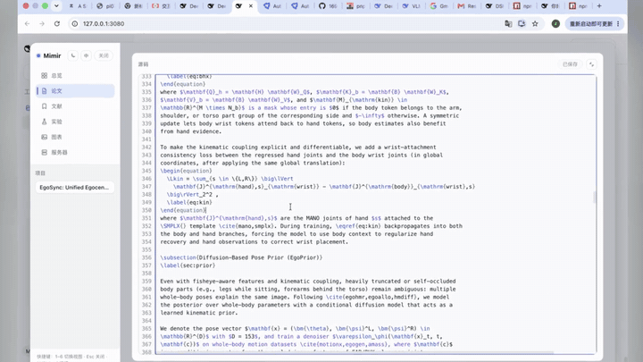
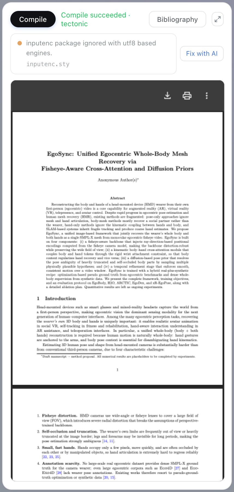

<div align="center">


<h1>Mimir</h1>

<p><strong><a href="https://github.com/deepseek-ai/deepseek-harness">DeepSeek Harness</a> 里的科研生命周期副驾：</strong><br>
arXiv 文献 · 持久化研究 wiki · 实验与远程 GPU · 图表 · LaTeX 写作 → 编译 → 预览——一个工作台，由你的 agent 驱动。</p>

<p>
<a href="https://github.com/1692775560/dsh-Mimir-Academic-research/actions/workflows/ci.yml"></a>
<a href="https://www.npmjs.com/package/dsh-mimir"></a>
<a href="https://www.npmjs.com/package/dsh-client-ui-mimir"></a>
<a href="LICENSE"></a>
</p>

<p><a href="README.md">English</a> · <strong>中文</strong></p>

<p><a href="#视频演示">演示视频</a> · <a href="#快速上手">快速上手</a> · <a href="#功能">功能</a> · <a href="#使用指南">使用指南</a> · <a href="#更新日志">更新日志</a></p>

</div>

## 视频演示

[](https://raw.githubusercontent.com/1692775560/dsh-Mimir-Academic-research/main/docs/media/mimir-demo.mp4)

▶ **[在线播放或下载完整 MP4 演示](https://raw.githubusercontent.com/1692775560/dsh-Mimir-Academic-research/main/docs/media/mimir-demo.mp4)**（22 MB）——涵盖 AI 辅助科研、文献管理、实验管理、图表归档和论文写作，平滑缩放突出各个工作流程。


## 功能

**五个斜杠命令**

| 命令 | 作用 |
| --- | --- |
| `/research-idea <方向>` | 注册项目、脚手架 `IDEA_REPORT.md`、调研 arXiv、记录想法 |
| `/research-plan [项目]` | 脚手架 `EXPERIMENT_PLAN.md`；计划中的主张登记为待定 wiki 主张 |
| `/research-review <范围> <文件...>` | 对工件（方案/论文）进行独立的新 reviewer 评审轮次，按项目封顶 |
| `/paper-write [项目]` | 脚手架 `main.tex` 骨架并驱动撰写，直到编译干净 |
| `/paper-compile [目录]` | 用与工具相同的引擎路径直接产出编译报告 |

**五个 agent 工具**

| 工具 | 用途 |
| --- | --- |
| `arxiv_search` / `paper_fetch` | arXiv 检索；单篇抓取自动归档到文献库并关联项目 |
| `wiki_note` | 研究 wiki domain 的读写面（文献、想法、主张、实验、项目） |
| `figure_save` | 把生成的图（任意路径）复制进项目论文 `figures/` 目录，wiki 记录 caption/关联实验元数据，返回可直接粘贴的 LaTeX 图片块（机器上有可用转换器时 SVG 会自动转换为 PDF，兜底为 PNG） |
| `latex_compile` | 编译 `main.tex` 并给出解析后的文件/行号诊断；多引擎：`latexmk` 或 `tectonic`（自动探测，或显式二进制路径） |

**九个内置科研 skills**

当宿主组合挂载了 skill registry（自带的 web profile 已挂载）时，Mimir 会向 agent 的 skill 目录注册九个工作流 playbook——零配置。它们沉淀的是科研方法论（何时把什么写进 wiki、下一道门槛是什么），驱动上面列出的工具与命令。项目级同名 skill 会覆盖内置版本，团队可以替换掉任何一个 playbook。

| Skill | Playbook |
| --- | --- |
| `research-pipeline` | 端到端编排：立意 → 查新门槛 → 文献 → 计划 → 实验 → 主张门槛 → 写作 → 评审 |
| `research-lit-review` | 经 `arxiv_search` + `paper_fetch` 在 wiki 中建带笔记的文献库；配置后可接 Zotero 导入与 arXiv 订阅 |
| `research-novelty-check` | 带结论的查新门槛——花算力之前，从机理 / 应用 / 结果三个角度做实时检索 |
| `research-experiment-plan` | 主张驱动、带预算的运行排序，落到 wiki 实验记录并对照服务器面板可行性 |
| `research-result-to-claim` | 实验后门槛：结果支撑 / 推翻 / 搁置哪些主张，并指出能定夺的那一组实验 |
| `research-paper-drafting` | 逐节 LaTeX 写作，随写随编译，只写已支撑的主张 |
| `research-citation-audit` | 零信任参考文献审计：每条 .bib 记录实时检索验证，每处引用都要名副其实 |
| `research-rebuttal` | 把审稿意见拆成原子关切，基于证据、在会议篇幅限制内起草回复 |
| `research-figure-plan` | 设计能支撑主张的图，可复现地产出，并经 `figure_save` 归入图表面板 |

可用 `skills.enabled: false` 关闭（见配置参考）。

### Web 工作台——六视图，一个浮层

侧栏开关打开 96vw×95vh 工作台：

| 视图 | 亮点 |
| --- | --- |
| 📊 **总览** | 五阶段流水线进度、统计芯片、工件清单、最近动态（最近远程任务 + 实验运行）、整库 wiki 导出/导入（替换有红字二次确认） |
| 📝 **论文** | Overleaf 式三栏工作室：大纲拖拽重排、自动保存编辑器（窗口化语法高亮，几千行也流畅）、一键编译、点击跳源码行的错误列表（每条带**「让 AI 修」**按钮）、内嵌 PDF 预览、`references.bib` 面板、头部常显项目名 |
| 📚 **文献** | 收录论文的标签/笔记/项目关联、面板内 arXiv 搜索一键导入、逐卡片加入 `references.bib`、一键**「生成 related work 草稿」**把筛选结果连同写作要求发给 agent |
| 🧪 **实验** | 运行记录与指标对比图、内联新增/编辑表单、服务器内联换绑、远程任务 settle 自动**回写最近任务徽标**、任意对比图一键**生成论文图**、`EXPERIMENT_LOG.md` 渲染 |
| 🖼️ **图表** | 论文目录图片网格：预览、拖拽上传、复制 LaTeX 引用、插入论文（SVG 宿主侧自动转 PDF/PNG）；`figure_save` 入库的图带 caption + 关联实验徽标 |
| 🖥️ **服务器** | GPU 机器卡片：TCP 探测 + SSH `nvidia-smi` 读取（利用率/显存条、标签筛选）；提交远程命令为实时轮询任务，输出尾部可展开，可关联实验联动状态 |

面板头部带深色/浅色主题和中/EN 语言切换。键盘优先：`1–6` 或方向键切换视图、`Esc` 关闭、`⌘/Ctrl+Enter` 编译；对话框有焦点陷阱，所有控件带可见焦点环。窄窗口自动降级（不足 900px 时论文视图变单栏；不足 700px 时侧栏变为顶部水平条）。

| 深色模式：总览 | 深色模式：论文 | 论文：窄屏 tab 布局 |
| --- | --- | --- |
|  |  |  |

## 快速上手

Mimir 由两个 npm 包组成：

- `dsh-mimir`：研究命令、工具、wiki、评审循环与服务端接口。普通使用只需安装这个包。
- `dsh-client-ui-mimir`：六视图 Web 工作台。它需要集成到 dsh 的 Web 客户端中，不能仅靠安装 npm 包自动出现在侧栏。

当前发布版本可随时通过 npm 查询：

```sh
npm view dsh-mimir version
npm view dsh-client-ui-mimir version
```

### 前置要求

- **Node.js**——v22 或更高；在 Node v24 上开发并验证。
- **pnpm**——在 v11.18 上验证。
- **dsh CLI**——已发布在 npm：
  ```sh
  npm install -g @deepseek-ai/dsh
  dsh --version
  ```
- **`DEEPSEEK_API_KEY`**——agent 会话必需（导出环境变量，或写入 dsh 的 `.env`）。
- **LaTeX 引擎**——仅论文编译需要：PATH 上的 `latexmk` 或 `tectonic`。tectonic 是单二进制，最好装：
  ```sh
  brew install tectonic        # macOS；其他平台见 https://tectonic-typesetting.github.io
  ```
- **arXiv 访问**——文献检索请求 `export.arxiv.org`；在代理环境下，启动 dsh 前导出 `HTTPS_PROXY`。

### 1. 安装 Mimir

推荐通过 dsh 的 `web` profile 安装最新版宿主插件：

```sh
dsh plugin --profile web add dsh-mimir@latest
```

如果只想把包加入现有 Node.js 项目，也可以使用 npm：

```sh
npm install dsh-mimir@latest
```

### 2. 启动 Mimir

仓库已经提供可直接使用的 dsh patch。克隆仓库后无需构建，即可用已安装的 npm 插件启动：

```sh
git clone https://github.com/1692775560/dsh-Mimir-Academic-research.git
cd Mimir
dsh web --patch "$PWD/examples/mimir-agent/cordis.yml"
```

然后打开 <http://127.0.0.1:3080>。wiki 默认保存在 `~/.dsh/storages/research_wiki.json`；文献、生成图、论文和实验等科研工件保存在启动目录下的 `./.research`。

### 3. 开始使用

在 dsh 会话中（Web UI 或使用同一 patch 的 TUI）依次尝试：

```text
/research-idea efficient long-context retrieval for code agents
/research-plan
/research-review plan EXPERIMENT_PLAN.md
/paper-write
/paper-compile
```

### 4. 升级

重新安装 `latest` 即可升级宿主插件，完成后重启 `dsh web`：

```sh
dsh plugin --profile web add dsh-mimir@latest
npm view dsh-mimir version
```

如果是在 Node.js 项目中直接安装的依赖，则运行：

```sh
npm install dsh-mimir@latest dsh-client-ui-mimir@latest
```

### 5. 完整 Web 工作台

Web 工作台包可通过 npm 安装：

```sh
npm install dsh-client-ui-mimir@latest
```

但需要注意：当前已发布的 dsh Web 组合不会自动发现独立客户端插件，也不会自动挂载 `research` Remote 命名空间。因此，仅安装 `dsh-client-ui-mimir` 不会让 Mimir 按钮自动出现在侧栏。完整六视图界面目前需要在 dsh 源码项目中注册该客户端包，并完成 [已知限制](#已知限制) 中说明的 Remote 装配；宿主侧的研究命令、工具、wiki、自动保存和 `/research/*` 接口不受此限制。

### 6. 从源码开发（可选）

只有参与 Mimir 开发或集成完整 Web 工作台时才需要构建源码：

```sh
git clone https://github.com/1692775560/dsh-Mimir-Academic-research.git
cd Mimir
pnpm install
pnpm run build
pnpm test
```

dsh 从 profile 目录（`~/.dsh/profiles/web`）解析 patch 中的插件名，而不是从当前目录解析。要测试本地构建，请将本地包加入 profile：

```sh
dsh plugin --profile web add "$PWD/packages/mimir"
```

## 使用指南

耗时操作——编译、导入、全部探测、删除、上传——结束时会在工作台右下角弹一张 toast 小卡片（按结果分绿/蓝/红描边，几秒后自动消失，也可点 × 提前关闭）。

<details>
<summary><strong>📊 总览</strong>——流水线进度 · 最近动态 · wiki 导出/导入</summary>

落地视图：所选项目的五阶段流水线进度、统计芯片（文献/实验/图表/服务器）、工件清单与时间戳。**最近动态**卡片并列展示最近 5 条远程任务（命令、状态徽标、相对时间）和最近 5 条实验运行。**数据卡片**显示自动备份状态（周期、保留份数、已备份份数），并可以把整个 wiki 导出为一份带日期的 JSON 快照（`mimir-wiki-<日期>.json`）用于备份或迁移，也可以导入回放：选择文件（`<workspaceDir>/backups/` 下的自动备份可直接选）、确认逐表行数摘要，然后选合并（已存在主键跳过、绝不覆盖）或替换（先清空七张表——有红字二次确认）。导入成功后会刷新所有已加载的视图，并用 toast 汇报导入/跳过总数。

| 总览 | 总览：wiki 导出/导入 |
| --- | --- |
|  |  |

</details>

<details>
<summary><strong>📝 论文</strong>——Overleaf 式工作室 · 让 AI 修 · PDF 实时预览</summary>

项目论文目录的 Overleaf 式编辑器：可折叠大纲栏（顶层章节从行首手柄拖拽重排，重写 `main.tex` 的 `\section` 顺序）、自动保存的 `main.tex` 编辑器（约 800 ms 防抖、乐观并发——被顶掉的草稿会冻结并提供重载）带 LaTeX 语法高亮与同步行号（高亮层和行号都按可视区窗口化渲染，几千行的论文也保持流畅）、一键编译（标注引擎）、点击跳源码行的错误列表（每条还带**「让 AI 修」**按钮——把该 issue、带行号的 ±3 行源码窗口和修复要求组装成 prompt 发给当前会话的 agent）、内嵌 PDF 预览，以及覆盖 `references.bib` 的参考文献面板（删除条目、冲突安全保存、勾选文献库论文追加）。编辑器头部常显当前项目名——多项目并行时一眼确认在改哪篇。未再改动的草稿保存成功约 1.5 s 后自动编译。每次编译成功还会自动把论文的 `.tex`/`.bib` 源码存成快照（每项目保留最近 50 个，位于 `<workspaceDir>/snapshots/<projectId>/`）；「快照」面板按时间倒序列出，可逐行对比任一快照与当前源码的差异，也可确认后回滚——回滚沿用编辑器保存的乐观并发语义，agent 中途动过文件会报冲突而不是静默覆盖。拖拽手柄调整三栏宽度（布局持久化）；编辑器/预览可一键全屏。`⌘/Ctrl+Enter` 编译。

| 论文：语法高亮 | 论文：编译问题 | 论文：让 AI 修 | 论文：点击跳源码行 |
| --- | --- | --- | --- |
|  |  |  |  |

| 论文：参考文献面板 | 论文：编辑器全屏 |
| --- | --- |
|  |  |

</details>

<details>
<summary><strong>📚 文献</strong>——arXiv 搜索 · 笔记与标签 · related work 草稿</summary>

每一篇收录论文都是一张卡片（摘要默认三行折叠）：可编辑标签、按项目关联、标签/当前项目筛选栏，以及面板内 arXiv 搜索——一键把结果导入 wiki，再一键追加到项目的 `references.bib`。工具栏的**「生成 related work 草稿」**按钮把当前筛选出的文献（标题、摘要、你的笔记、引用键）发给当前会话的 agent，要求按主题组织成 `\section{Related Work}`、`\cite` 恰好覆盖这些键、缺失条目补进 `references.bib`，并重新编译直到干净。

| 文献 | 文献：标签 | 文献：arXiv 搜索 |
| --- | --- | --- |
|  |  |  |

</details>

<details>
<summary><strong>🧪 实验</strong>——指标对比图 · 任务回写 · 一键论文图</summary>

wiki 中的运行记录：每行状态徽标、≥2 个 run 共享的数值指标对比条形图、逐 run 可展开指标、服务器关联 badge 内联下拉换绑、行编辑/删除。每张对比图带**「生成论文图」**按钮：渲染成独立矢量 SVG 条形图、存进论文 `figures/`（wiki 登记自动 caption）、自动转换后把现成的 `\begin{figure}` 块插进 `main.tex`。关联的远程任务 settle 时，行内**「最近任务」**徽标显示结果、耗时和完成时间（悬浮看日志尾部），同一结果也会追加到 `EXPERIMENT_LOG.md`。工具栏的**新增实验**打开内联表单（名称、状态、指标键值对行编辑器——能解析成数字的值存为数字——、可选服务器关联），走 `saveExperiment` Remote upsert；行内**编辑**按钮回填同一表单。表格下方是用内置受限 Markdown 渲染器渲染的 `EXPERIMENT_LOG.md`（标题、强调、代码、代码块、列表、引用、分隔线、表格、链接——非 http(s) 的链接一律中性化为纯文本）。

| 实验 |
| --- |
|  |

</details>

<details>
<summary><strong>🖼️ 图表</strong>——图片网格 · 拖拽上传 · 插入论文</summary>

论文目录的图片网格：点击放大、复制现成的 LaTeX `\includegraphics` 片段、工具栏按钮上传——或直接把图片文件拖进视图（悬停时显示虚线高亮框；不支持的类型会点名提示而非静默忽略）——以及删除不再需要的文件。刷新按钮强制重扫。

| 图表 | 图表：拖拽上传 |
| --- | --- |
|  |  |

</details>

<details>
<summary><strong>🖥️ 服务器</strong>——GPU 探测 · 远程任务 · 实验联动</summary>

登记的 GPU 机器：增删改、一键 TCP 连通性探测，以及尽力而为的 SSH `nvidia-smi` 读取（每块 GPU 的利用率与显存条）。卡片上的标签 chips 与网格上方的筛选条让大量机器也好找。网格下方的**远程任务**区块可向任意已登记服务器经 SSH 提交命令（`submitJob` Remote；命令后台执行，会话上限 30 分钟）：有任务在排队/运行中时每 2 秒轮询一次任务表，状态徽标按 queued → running → succeeded/failed 翻转并弹 toast，stdout/stderr 尾部可展开；关联当前项目实验记录的任务会在提交时把该实验置为 running 并挂上服务器，结束时置为 success/failed。

| 服务器 |
| --- |
|  |

</details>

### 斜杠命令实战

dsh 会话里的典型循环：

```
/research-idea efficient long-context retrieval for code agents
```

在 wiki 里注册项目、在工作区脚手架 `IDEA_REPORT.md`、调研该方向的 arXiv 文献并记录想法——失败的想法永不删除，因此重蹈死路会被标记而不是重复。

```
/research-plan
/research-review plan EXPERIMENT_PLAN.md
```

`research-plan` 脚手架 `EXPERIMENT_PLAN.md`，并把计划中的主张登记为待定 wiki 主张。`research-review` 启动一个**全新的 reviewer 子代理**——它只收到列出的文件路径，永远看不到执行者的摘要——返回 schema 校验过的 PASS/WARN/FAIL 结论；WARN/FAIL 会作为修订任务交回给 agent，每个项目最多 `reviewer.maxRounds` 轮（默认 3）。

```
/paper-write
/paper-compile
```

`paper-write` 脚手架 `main.tex` 骨架并撰写到编译干净；`paper-compile` 跑一次编译并直接报告解析后的错误/警告。

### Agent 工具实战

agent 在对话中途可以触达同一组能力：

- `arxiv_search`——“搜一下最近的 whole-body mesh recovery 论文”（默认上限 `arxiv.maxResults`）；搜索结果不会直接污染文献库。
- `paper_fetch`——按 arXiv id 抓取有价值的单篇文献，同时自动保存完整元数据、用途笔记与标签，并关联显式 `project_id`（未传时关联最近活跃项目）。重复抓取会刷新 arXiv 元数据，但保留已有笔记、标签、项目关联和本地 PDF。
- `wiki_note`——wiki 的读写面，以 `action` 为键的一套扁平参数：`add_paper`、`add_idea`、`fail_idea`、`add_claim`、`set_claim`、`set_project`（把项目指向它的论文目录）、`add_experiment`、`set_experiment`（状态 `running`/`success`/`failed`），以及对五张表的 `list` 和 `get`。
- `latex_compile`——“编译 `paper/` 里的论文”（`project_dir` 参数）；返回解析后的文件/行号诊断。

### 内置 skills 实战

九个内置 skill 不需要特殊调用语法——agent 的 skill 目录会从自然语言请求路由过去（“帮我查新一下这个想法”、“提交前审一遍引用”、“规划一下消融实验”）。它们是 playbook 而不是新能力：每一步驱动的都是上面列出的同一组工具、命令和 wiki 表，所以 skill 做的一切都在工作台里可见。要覆盖某一个，把同名 `SKILL.md` 放进项目的 skill 根目录即可——项目级条目优先于内置 runtime 条目。

## 配置参考

所有键都可缺省；以下默认值来自 `packages/mimir/src/index.ts`：

| 键 | 默认值 | 含义 |
| --- | --- | --- |
| `workspaceDir` | `.research` | 科研工作区根目录，相对进程 cwd 解析；必须是非空路径 |
| `reviewer.provider` | `spawn` | 评审轮次的子代理 provider 路由 |
| `reviewer.maxRounds` | `3` | 每个项目的评审轮次预算（正整数） |
| `latex.engine` | `auto` | `auto`（依次探测 PATH 上的 `latexmk`、`tectonic`）、引擎名，或绝对二进制路径（按 basename 选择方言） |
| `latex.timeoutMs` | `120000` | 编译杀进程超时（毫秒）；tectonic 首次联网拉包时可调大 |
| `arxiv.maxResults` | `10` | `arxiv_search` 的默认结果上限 |
| `backup.enabled` | `true` | wiki 定时自动备份开关；`false` 完全关闭 |
| `backup.intervalMinutes` | `60` | 备份周期（分钟，正整数）；插件启动 1 分钟后做首次备份 |
| `backup.keep` | `24` | 保留最近 N 份，超出裁剪（正整数） |
| `backup.dir` | `backups` | 备份目录，相对 `workspaceDir` 解析（也接受绝对路径） |
| `skills.enabled` | `true` | 把九个内置科研 skill 注册进组合的 skill registry（已挂载时）；`false` 跳过注册 |

带注释的完整示例见 [examples/mimir-agent/cordis.yml](examples/mimir-agent/cordis.yml)。

## 故障排查

- **`dsh: plugin tree failed to load … Cannot find package 'dsh-mimir'`**——patch 从 profile 目录取插件名，而不是你的当前目录。执行[安装步骤](#2-把插件装进-web-profile)：`dsh plugin --profile web add <仓库>/packages/mimir`。
- **`pnpm install` 报 `ERR_PNPM_IGNORED_BUILDS`**——pnpm ≥ 11.18 要求显式批准构建脚本；本仓库的 `pnpm-workspace.yaml` 已为 `esbuild` 固定好 `allowBuilds`，全新检出即可通过。如果你自行添加了带构建脚本的依赖（比如把 dsh CLI 装成 dev dependency），在同一个 `allowBuilds` 映射里批准即可。
- **找不到 LaTeX 引擎**——装 tectonic（单二进制）：macOS 用 `brew install tectonic`，其他平台见 <https://tectonic-typesetting.github.io>。也可以把 `latex.engine` 指到绝对二进制路径。`engine: auto` 先探测 `latexmk`，再探测 `tectonic`。
- **编译报错**——`/paper-compile` 打印解析后的文件/行号诊断；在工作台论文视图里点击错误会跳到对应源码行。tectonic 首次运行要联网下载宏包——初次编译超时就把 `latex.timeoutMs` 调大。
- **arXiv 搜索失败**——工具请求 `export.arxiv.org`；检查连通性，代理环境下在启动 dsh 前导出 `HTTPS_PROXY`/`HTTP_PROXY`。
- **数据在哪 / 怎么备份**——wiki 在 `~/.dsh/storages/research_wiki.json`，科研工件在 `workspaceDir`（默认 `./.research`）下。双轨备份：host 每 `backup.intervalMinutes` 自动写一份全量快照到 `<workspaceDir>/backups/mimir-wiki-<UTC 时间戳>.json`（保留最近 `backup.keep` 份，原子写，失败只告警、下个周期重试），总览视图的数据卡片也可以随时手动导出同格式快照。两种文件都能从数据卡片导入回放（合并是非破坏性的）——从自动备份恢复时，在导入流程里直接选 `backups/` 下的文件即可。

## 已知限制

- **工作台的 Remote 命名空间需要由客户端 Remote 装配挂载。** dsh 已发布的 `@deepseek-ai/dsh-api-remotes` 早于 Mimir，没有挂载 `research` 命名空间；把 Mimir 生成的贡献加进你的装配（一行）：

  ```ts
  import researchRemote from 'dsh-mimir/remote'
  // 在装配的 apply() 里，与其他贡献并列：
  disposers.push(await ctx.remote.$mount(researchRemote))
  ```

  客户端插件（`dsh-client-ui-mimir`）同样要在 web 组合里注册。这是 dsh 侧的设计约束（装配是显式白名单），不是 Mimir 的缺陷——见[快速上手第 5 步](#5-web-工作台)。
- **编译状态是宿主进程内存**——宿主重启会忘掉上次结果；即使磁盘上还留着之前构建的 `main.pdf`，面板也会显示 `idle` 直到下一次编译。
- **无实时推送**——面板不轮询也不订阅；在别处启动的编译（`/paper-compile` 或工具）要到下一次选择或编译时才可见。

## 开发

```sh
pnpm install
pnpm run build       # 有序流水线：mimir 类型检查 → mimir 打包（产出
                     # ui-mimir 类型检查所依赖的 typert 工件）→ ui-mimir
pnpm test            # vitest，覆盖两个包
pnpm run typecheck   # tsc -b 两个包；需先构建（ui-mimir 引用生成的
                     # dsh-mimir/remote 声明）
```

目录结构：

- `packages/mimir`——宿主插件（`dsh-mimir`）：命令、工具、wiki domain、评审循环、LaTeX 编译、BibTeX 管理、论文快照、arXiv 关键词订阅（定时检查新论文）、`research` Remote 命名空间（50 个方法），以及 `/research/pdf` / `/research/figure` / `/research/figure-upload` 路由。
- `packages/ui-mimir`——浏览器工作台（`dsh-client-ui-mimir`）：侧栏开关 + 浮层面板。
- `packages/typert-protocol`——Typert 协议的 vendored 源码副本，从不发布（见下）。
- `examples/mimir-agent`——快速上手使用的 cordis patch。

构建产物：`packages/mimir/lib/{index.js, invariant.js, typert.host.js, typert.remote-client.js, types/}` 与 `packages/ui-mimir/lib/{index.js, invariant.js, client.js, types/}`。

`packages/ui-mimir/scripts/screenshot.ts` 是 QA 工具（不属于测试套件）：对着一个挂载了插件的运行中 `dsh web` 实例，把工作台每个 tab 截一张 PNG 到 `/tmp/research-ui/`。需要本地安装 Playwright；按机器调整文件顶部的 import/`CHROMIUM` 路径。

贡献方式：从 `main` 拉分支（`feature/<名字>` 或 `fix/<名字>`），保持 `pnpm run build && pnpm test && pnpm run typecheck` 全绿，然后开 PR。

### 仓库说明

- `packages/typert-protocol` 是 `@deepseek-ai/dsh-typert-protocol@0.1.0-rc.8` 的 **vendored、从不发布**的源码副本：Typert 生成器只识别 workspace 注册包内声明的 `Remote` 元数据，因此协议必须在仓内编译。运行时消费者仍然解析 npm 发布版。
- Typert 生成运行在**按贡献者过滤的 workspace 模式**（`packages/mimir/tsdown.config.ts` 里 `mode: 'workspace'`）：只有暴露 `./typert`/`./remote` 入口的包——仅 dsh-mimir——会被建模。默认的包模式会连带分析 vendored 协议，而后者在被 npm 发布版增强的 Typert map 接口上会失败（session/agent 有意保持为 npm 外部依赖，正是为了让它们的类型永不展开）。
- `build/client-preset/` vendored 了 dsh 客户端打包的 tsdown 预设（闭包工厂浏览器产物 + lightningcss 流水线），裁剪到本仓库所需的范围。

## 更新日志

### 0.8.1

- 修复：没有论文目录的项目会导致整个项目列表加载失败（`paperDir` 以显式 `undefined` 输出，过不了网关的 JSON 边界校验）；`submitJob` 未关联实验时的 `experimentId` 是同款隐患。两处现在都在缺省时完全省略该键，附回归测试。
- 论文页：窄窗格下头部按钮和保存徽标不再逐字换行（项目名/编译状态用省略号吸收挤压）。
- 文献页：订阅新文献列表可折叠（默认折叠；手动检新成功后自动展开一次；状态持久化）。侧栏项目列表也可折叠，折叠后仍显示当前项目名。

### 0.8.0

- 九个**内置科研 skills**（`research-pipeline`、`research-lit-review`、`research-novelty-check`、`research-experiment-plan`、`research-result-to-claim`、`research-paper-drafting`、`research-citation-audit`、`research-rebuttal`、`research-figure-plan`）在宿主挂载 skill registry 时注册进 agent 的 skill 目录；`skills.enabled: false` 可关闭，项目级同名 skill 可覆盖。
- 文档截图按 Linear 风格新工作台全部重拍。

### 0.7.0

- **Zotero Web API 集成（只读）**：浏览收藏集、检索文献库、把条目导入 wiki（arXiv 关联或 `zotero-<key>` 条目）、导出收藏集为 `.bib`；凭据只走 `zotero.apiKey` / `zotero.userId` 配置，不进 wiki、日志或面板。
- 全工作台 **Linear 风格视觉重构**：发丝边框、内联编译错误行、更清晰的排版层级，深浅色独立调校。

### 0.6.0

- **arXiv 订阅**：按查询词每日检新（文件系统存储），文献视图带未读徽标。
- **PDF 阅读笔记**：内嵌阅读器的时间戳笔记侧栏。
- 服务器探测**分阶段进度**（TCP → SSH → GPU 读数），失败归因到具体层级。

### 0.5.0

- **论文版本快照**：每次编译成功自动快照源码（保留 50 份）；任意两份 diff，带乐观并发保护回滚。
- 实验记录防旧任务覆盖；浅色主题对比度修正；内部 service 拆分重构。

### 0.4.0

- 文献：一键**生成 related work 草稿**——把筛选出的文献（标题、摘要、笔记、引用键）连同主题写作与引用要求发给会话 agent。
- 实验：任意指标对比图一键**生成论文图**——独立矢量 SVG，经新 Remote `saveFigure` 存进 `figures/`，自动转换并插入 `main.tex`。
- 论文：编辑器头部常显**当前项目名**。

### 0.3.0

- 图表：**插入论文**——现成的 `\begin{figure}` 块（caption、净化 label）落到 `\end{document}` 前，带重复检测与跳转；**SVG 自动转换**为 PDF（rsvg-convert/inkscape/magick）或 PNG（macOS `qlmanage` 兜底），`figure_save` 工具同样支持。
- 论文：每条编译 issue 带**「让 AI 修」**按钮，把错误和源码上下文发给会话 agent。
- 实验：远程任务 settle 后自动**回写**关联实验——状态翻转、结果/耗时/日志尾部徽标、`EXPERIMENT_LOG.md` 追加一行。

### 0.2.0

- `figure_save` 工具与 wiki `figures` 元数据表（caption、关联实验）。
- 工作台美化：可折叠大纲栏、项目名两行显示、卡片徽章自适应、指标标签折行、图表网格加密。

### 0.2.x / 0.1.x

- 编辑器高亮层与行号按可视区窗口化（大文件流畅）；深色模式原生表单控件适配；键盘导航、焦点陷阱与 ARIA 审查；大纲子章节拖拽；文献 PDF 抓取与内嵌阅读器；实验内联表单；SSH 远程任务；wiki 备份/导出/导入。

## 致谢

- 工作流灵感：[ARIS / Auto-claude-code-research-in-sleep](https://github.com/wanshuiyin/Auto-claude-code-research-in-sleep)
- 构建于 [DeepSeek Harness](https://github.com/deepseek-ai/deepseek-harness) 插件平台（Cordis、Typert、客户端模块系统）之上。

## License

[MIT](LICENSE)
