# Mimir

[](https://github.com/1692775560/Mimir/actions/workflows/ci.yml)

[English](README.md) | 中文

**Mimir 是 [DeepSeek Harness](https://github.com/deepseek-ai/deepseek-harness)（dsh）的科研生命周期插件套件：arXiv 文献检索、持久化研究 wiki、独立子代理评审，以及 LaTeX 写作 → 编译 → 预览闭环——外加一个完整的 web 工作台。**

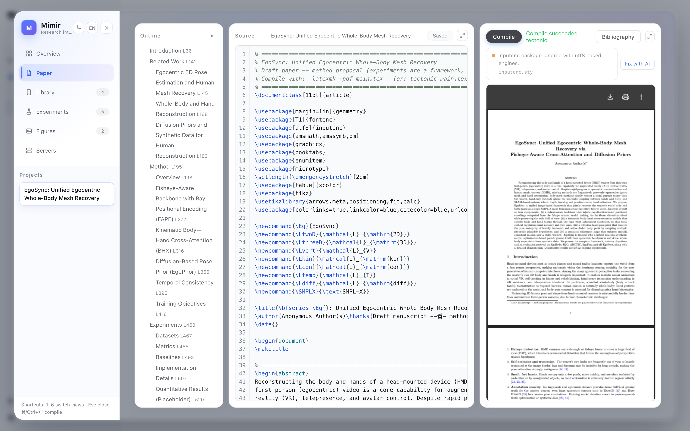

## 功能

**五个斜杠命令**

| 命令 | 作用 |
| --- | --- |
| `/research-idea <方向>` | 注册项目、脚手架 `IDEA_REPORT.md`、调研 arXiv、记录想法 |
| `/research-plan [项目]` | 脚手架 `EXPERIMENT_PLAN.md`；计划中的主张登记为待定 wiki 主张 |
| `/research-review <范围> <文件...>` | 对工件（方案/论文）进行独立的新 reviewer 评审轮次，按项目封顶 |
| `/paper-write [项目]` | 脚手架 `main.tex` 骨架并驱动撰写，直到编译干净 |
| `/paper-compile [目录]` | 用与工具相同的引擎路径直接产出编译报告 |

**五个 agent 工具**

| 工具 | 用途 |
| --- | --- |
| `arxiv_search` / `paper_fetch` | arXiv Atom API 检索与单篇抓取 |
| `wiki_note` | 研究 wiki domain 的读写面（文献、想法、主张、实验、项目） |
| `latex_compile` | 编译 `main.tex` 并给出解析后的文件/行号诊断；多引擎：`latexmk` 或 `tectonic`（自动探测，或显式二进制路径） |
| `figure_save` | 把生成图片保存到项目 `figures/`，记录 caption/实验关联，并返回 LaTeX 片段 |

**Web 工作台（六视图）**——侧栏开关打开 96vw×95vh 浮层：

- **总览**——流水线阶段进度、统计芯片、工件清单，以及数据卡片：把整个 wiki 导出/导入为一份带日期的 JSON 快照（合并跳过已存在主键；替换会先清空，有红字二次确认）。
- **论文**——大纲栏顶层章节可拖拽重排、`main.tex` 自动保存编辑器带 LaTeX 语法高亮、一键编译、点击跳源码行的错误列表、内嵌 PDF 预览、`references.bib` 面板；分栏可调宽、可全屏、布局持久化。
- **文献**——已收录论文：可编辑标签、按项目关联、标签/当前项目筛选栏、面板内 arXiv 搜索一键导入、逐卡片加入 `references.bib`。
- **实验**——运行记录：指标对比条形图（内联 SVG）、可展开指标、新增/编辑内联表单（指标键值对编辑器、服务器关联）、服务器关联 badge 内联换绑，以及渲染后的 `EXPERIMENT_LOG.md`。
- **图表**——论文目录图片网格：预览、上传（按钮或拖拽）、删除、复制 LaTeX 引用。
- **服务器**——登记的 GPU 机器：TCP 连通性探测 + 尽力而为的 SSH `nvidia-smi` 读取（利用率/显存条、标签筛选）；任务区块可经 SSH 提交远程命令（queued → running → succeeded/failed 实时轮询、stdout/stderr 尾部可展开、可关联实验记录并联动其状态）。

面板头部带深色/浅色主题切换和中/EN 语言切换；快捷键：`1–6` 切换视图、`Esc` 关闭、`⌘/Ctrl+Enter` 编译。窄窗口自动降级（不足 900px 时论文视图变单栏；不足 700px 时侧栏变为顶部水平条）。

| 深色模式：总览 | 深色模式：论文 | 论文：窄屏 tab 布局 |
| --- | --- | --- |
| 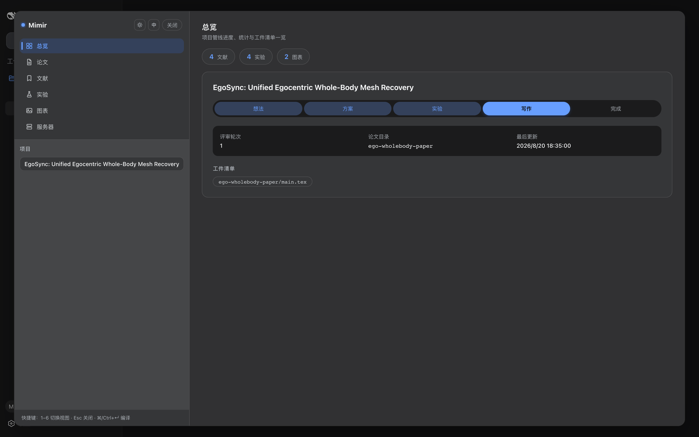 | 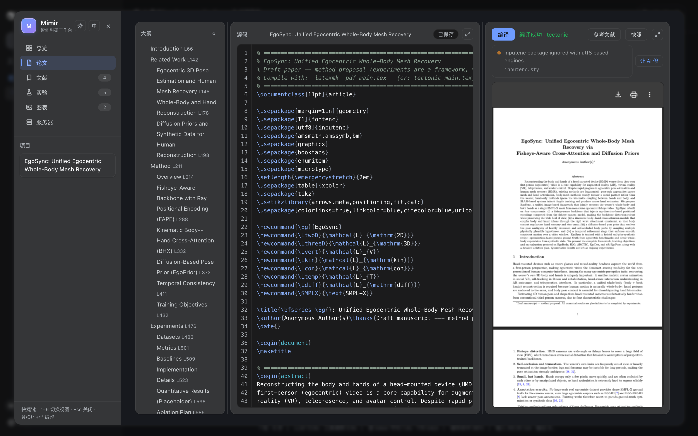 | 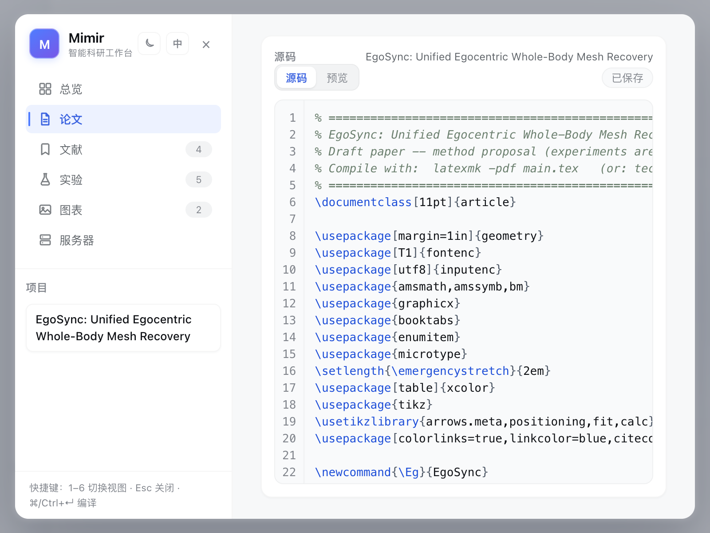 |

## 快速上手

> **状态说明：** 两个包已具备 tag 触发、带 provenance 的发布流水线，但首次 npm 发布仍需要发布者认证。在 `npm view dsh-mimir` 可查询前，请继续使用下方源码安装方式。

### 前置要求

- **Node.js**——v22 或更高；在 Node v24 上开发并验证。
- **pnpm**——在 v11.18 上验证。
- **dsh CLI**——已发布在 npm：
  ```sh
  npm install -g @deepseek-ai/dsh
  ```
- **`DEEPSEEK_API_KEY`**——agent 会话必需（导出环境变量，或写入 dsh 的 `.env`）。
- **LaTeX 引擎**——仅论文编译需要：PATH 上的 `latexmk` 或 `tectonic`。tectonic 是单二进制，最好装：
  ```sh
  brew install tectonic        # macOS；其他平台见 https://tectonic-typesetting.github.io
  ```
- **arXiv 访问**——文献检索请求 `export.arxiv.org`；在代理环境下，启动 dsh 前导出 `HTTPS_PROXY`。

### 1. 克隆并构建

```sh
git clone https://github.com/1692775560/Mimir.git
cd Mimir
pnpm install
pnpm run build
pnpm test          # 可选自检：vitest，覆盖两个包
```

### 2. 把插件装进 web profile

dsh 从 profile 目录（`~/.dsh/profiles/web`）解析 patch 里的插件名，**而不是**从当前目录——因此要把构建好的包 link 进 profile（profile 目录在 dsh 首次运行时创建）：

```sh
dsh plugin --profile web add "$PWD/packages/mimir"
```

### 3. 启动示例

```sh
dsh web --patch "$PWD/examples/mimir-agent/cordis.yml"
```

然后打开 http://127.0.0.1:3080。wiki 持久化在 `~/.dsh/storages/research_wiki.json`；科研工件落在工作区目录（默认 `./.research`，相对启动 dsh 时的目录）。

### 4. 第一个会话

在 dsh 会话中（web UI 或挂了同一 patch 的 TUI）：

```
/research-idea efficient long-context retrieval for code agents
/research-plan
/research-review plan EXPERIMENT_PLAN.md
/paper-write
/paper-compile
```

### 5. Web 工作台

六视图工作台以 `dsh-client-ui-mimir`（`packages/ui-mimir`）发布。有一个需要如实说明的限制：**已发布的 dsh web 组合早于 Mimir**——它既不加载这个客户端插件，也不挂载 `research` Remote 命名空间，因此仅靠 cordis patch 不会在侧栏出现 Mimir 按钮。今天要挂上面板，需要在 dsh 源码检出中注册客户端插件，并应用 [已知限制](#已知限制) 里的 Remote 装配一行。agent 侧的一切——斜杠命令、工具、wiki、评审循环、`/research/*` 路由——仅靠 patch 即可工作。

## 使用指南

耗时操作——编译、导入、全部探测、删除、上传——结束时会在工作台右下角弹一张 toast 小卡片（按结果分绿/蓝/红描边，几秒后自动消失，也可点 × 提前关闭）。

### 总览

落地视图：所选项目的五阶段流水线进度、统计芯片（文献/实验/图表/服务器）、工件清单与时间戳。**数据卡片**显示自动备份状态（周期、保留份数、已备份份数），并可以把整个 wiki 导出为一份带日期的 JSON 快照（`mimir-wiki-<日期>.json`）用于备份或迁移，也可以导入回放：选择文件（`<workspaceDir>/backups/` 下的自动备份可直接选）、确认逐表行数摘要，然后选合并（已存在主键跳过、绝不覆盖）或替换（先清空六张表——有红字二次确认）。导入成功后会刷新所有已加载的视图，并用 toast 汇报导入/跳过总数。

| 总览 | 总览：wiki 导出/导入 |
| --- | --- |
| 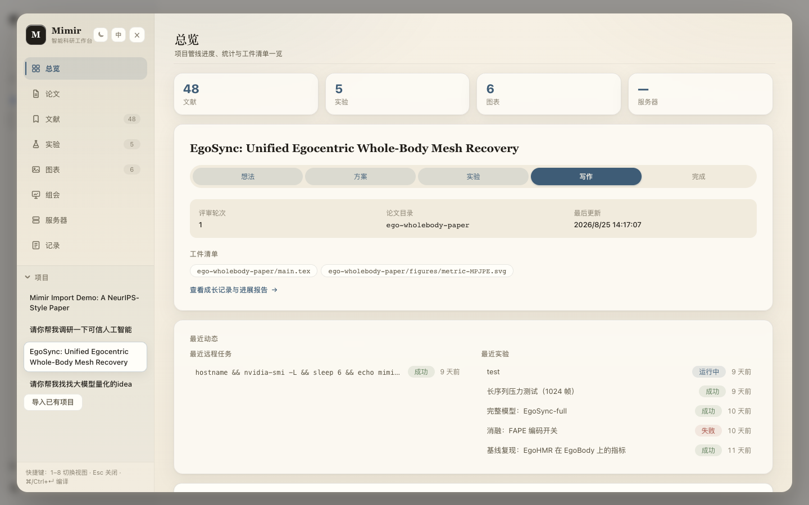 | 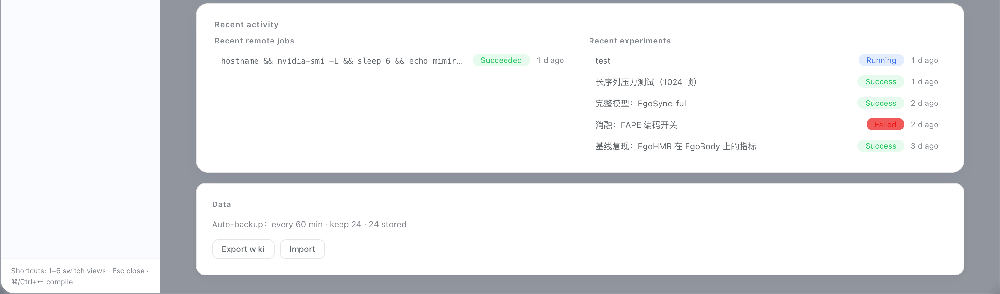 |

### 论文

项目论文目录的 Overleaf 式编辑器：可折叠大纲栏（顶层章节从行首手柄拖拽重排，重写 `main.tex` 的 `\section` 顺序）、自动保存的 `main.tex` 编辑器（约 800 ms 防抖、乐观并发——被顶掉的草稿会冻结并提供重载）带 LaTeX 语法高亮与同步行号、一键编译（标注引擎）、点击跳源码行的错误列表、内嵌 PDF 预览，以及覆盖 `references.bib` 的参考文献面板（删除条目、冲突安全保存、勾选股库论文追加）。未再改动的草稿保存成功约 1.5 s 后自动编译。拖拽手柄调整三栏宽度（布局持久化）；编辑器/预览可一键全屏。`⌘/Ctrl+Enter` 编译。

| 论文：语法高亮 | 论文：编译问题 | 论文：点击跳源码行 |
| --- | --- | --- |
| 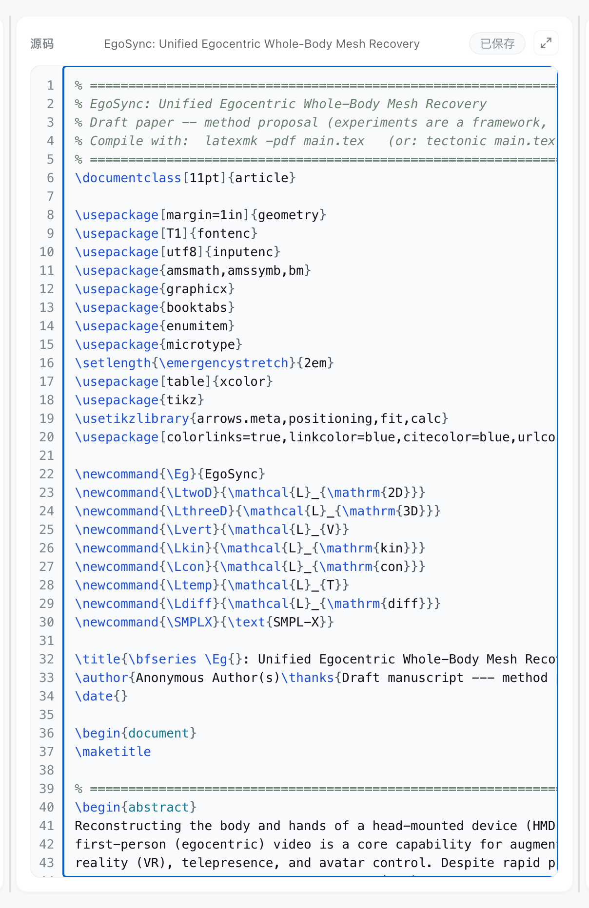 | 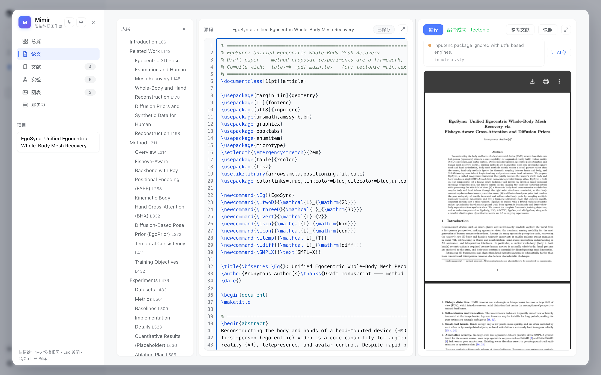 | 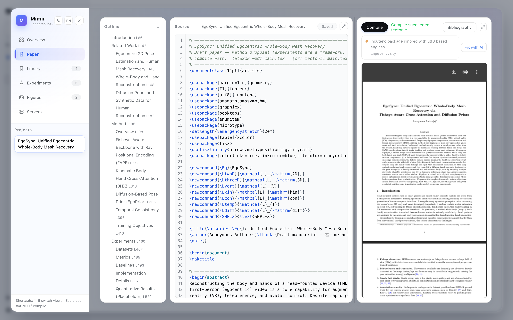 |

| 论文：参考文献面板 | 论文：编辑器全屏 |
| --- | --- |
| 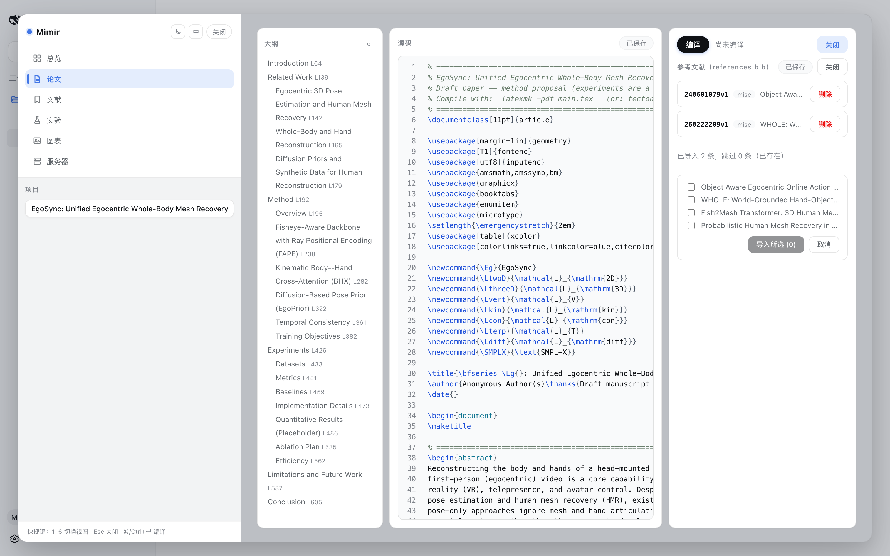 | 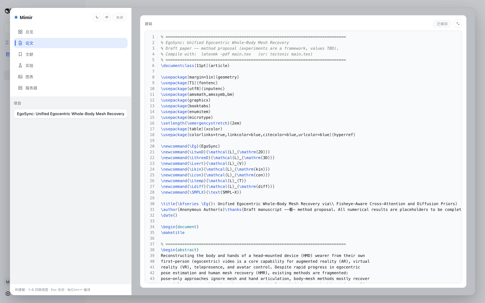 |

### 文献

每一篇收录论文都是一张卡片（摘要默认三行折叠）：可编辑标签、按项目关联、标签/当前项目筛选栏，以及面板内 arXiv 搜索——一键把结果导入 wiki，再一键追加到项目的 `references.bib`。

| 文献 | 文献：标签 | 文献：arXiv 搜索 |
| --- | --- | --- |
| 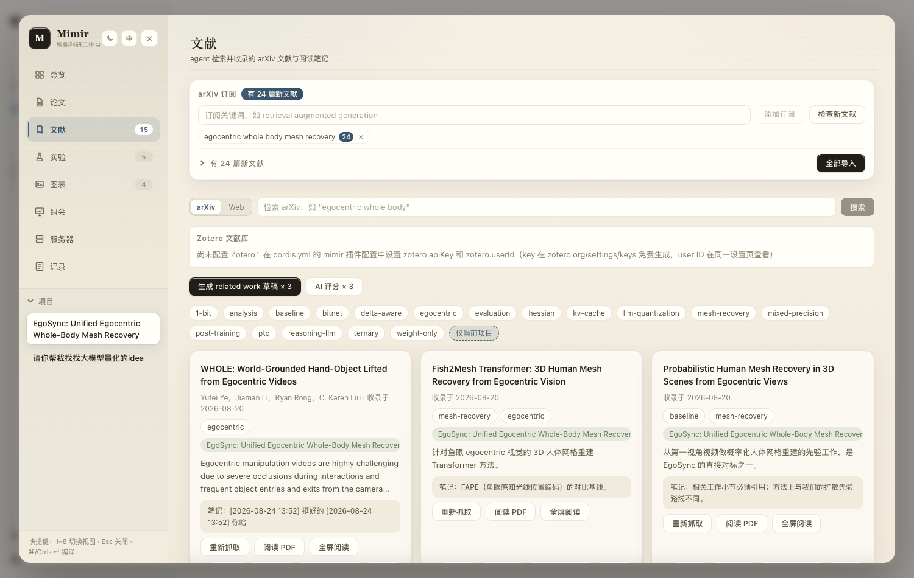 | 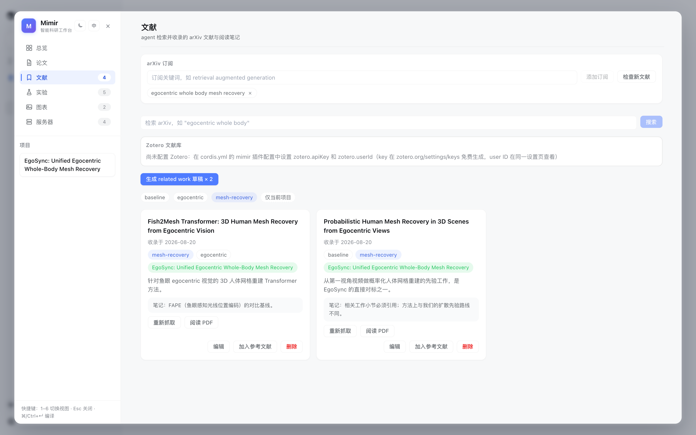 | 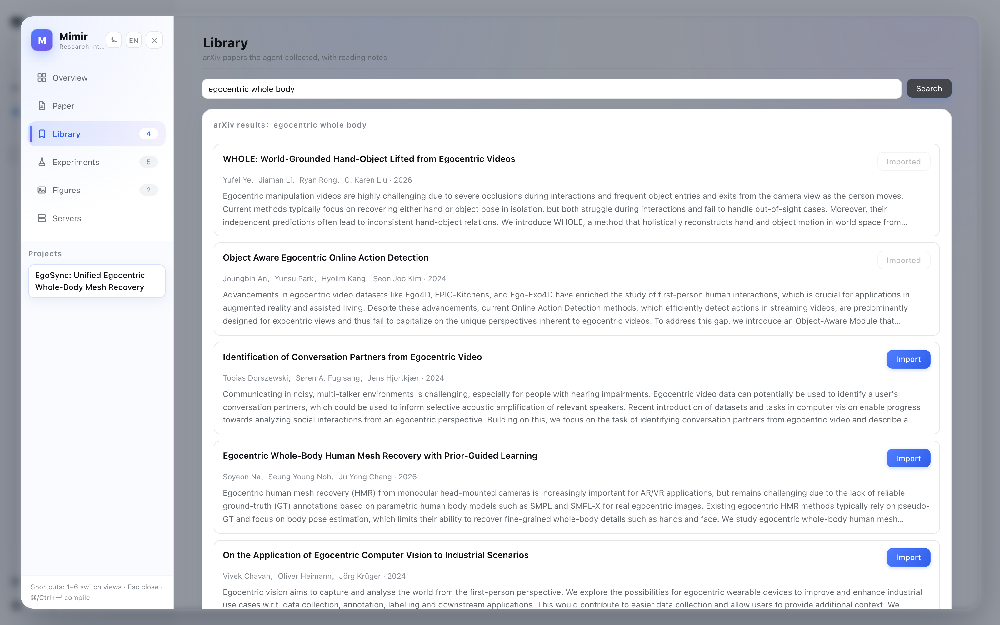 |

### 实验

wiki 中的运行记录：每行状态徽标、≥2 个 run 共享的数值指标对比条形图、逐 run 可展开指标、服务器关联 badge 内联下拉换绑、行编辑/删除。工具栏的**新增实验**打开内联表单（名称、状态、指标键值对行编辑器——能解析成数字的值存为数字——、可选服务器关联），走 `saveExperiment` Remote upsert；行内**编辑**按钮回填同一表单。表格下方是用内置受限 Markdown 渲染器渲染的 `EXPERIMENT_LOG.md`（标题、强调、代码、代码块、列表、引用、分隔线、表格、链接——非 http(s) 的链接一律中性化为纯文本）。

| 实验 |
| --- |
| 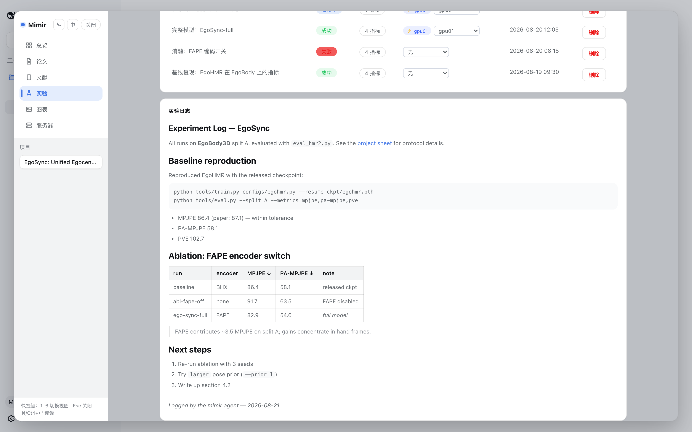 |

### 图表

论文目录的图片网格：点击放大、复制现成的 LaTeX `\includegraphics` 片段、工具栏按钮上传——或直接把图片文件拖进视图（悬停时显示虚线高亮框；不支持的类型会点名提示而非静默忽略）——以及删除不再需要的文件。刷新按钮强制重扫。

| 图表 | 图表：拖拽上传 |
| --- | --- |
| 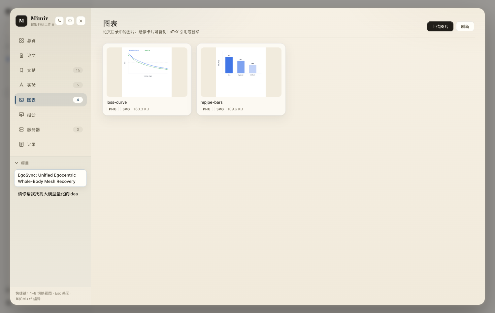 |  |

### 服务器

登记的 GPU 机器：增删改、一键 TCP 连通性探测，以及尽力而为的 SSH `nvidia-smi` 读取（每块 GPU 的利用率与显存条）。卡片上的标签 chips 与网格上方的筛选条让大量机器也好找。网格下方的**远程任务**区块可向任意已登记服务器经 SSH 提交命令（`submitJob` Remote；命令后台执行，会话上限 30 分钟）：有任务在排队/运行中时每 2 秒轮询一次任务表，状态徽标按 queued → running → succeeded/failed 翻转并弹 toast，stdout/stderr 尾部可展开；关联当前项目实验记录的任务会在提交时把该实验置为 running 并挂上服务器，结束时置为 success/failed。

| 服务器 |
| --- |
| 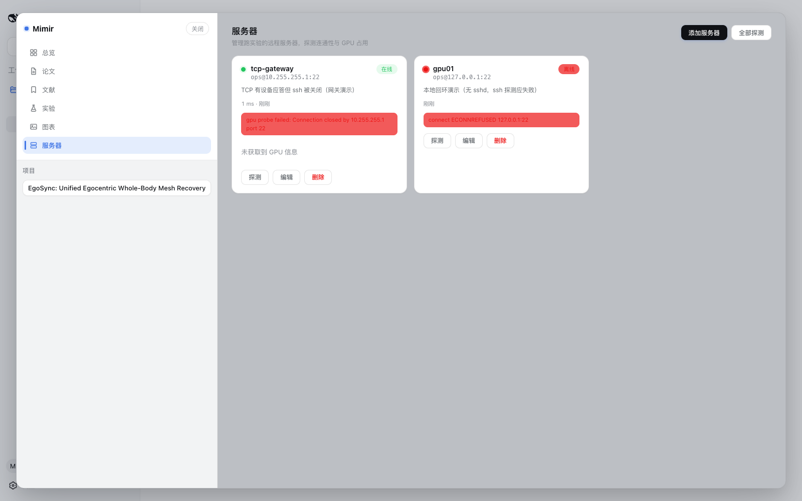 |

### 斜杠命令实战

dsh 会话里的典型循环：

```
/research-idea efficient long-context retrieval for code agents
```

在 wiki 里注册项目、在工作区脚手架 `IDEA_REPORT.md`、调研该方向的 arXiv 文献并记录想法——失败的想法永不删除，因此重蹈死路会被标记而不是重复。

```
/research-plan
/research-review plan EXPERIMENT_PLAN.md
```

`research-plan` 脚手架 `EXPERIMENT_PLAN.md`，并把计划中的主张登记为待定 wiki 主张。`research-review` 启动一个**全新的 reviewer 子代理**——它只收到列出的文件路径，永远看不到执行者的摘要——返回 schema 校验过的 PASS/WARN/FAIL 结论；WARN/FAIL 会作为修订任务交回给 agent，每个项目最多 `reviewer.maxRounds` 轮（默认 3）。

```
/paper-write
/paper-compile
```

`paper-write` 脚手架 `main.tex` 骨架并撰写到编译干净；`paper-compile` 跑一次编译并直接报告解析后的错误/警告。

### Agent 工具实战

agent 在对话中途可以触达同一组能力：

- `arxiv_search`——“搜一下最近的 whole-body mesh recovery 论文”（默认上限 `arxiv.maxResults`）。
- `paper_fetch`——按 arXiv id 抓取单篇元数据。
- `wiki_note`——wiki 的读写面，以 `action` 为键的一套扁平参数：`add_paper`、`add_idea`、`fail_idea`、`add_claim`、`set_claim`、`set_project`（把项目指向它的论文目录）、`add_experiment`、`set_experiment`（状态 `running`/`success`/`failed`），以及对五张表的 `list` 和 `get`。
- `latex_compile`——“编译 `paper/` 里的论文”（`project_dir` 参数）；返回解析后的文件/行号诊断。

## 配置参考

所有键都可缺省；以下默认值来自 `packages/mimir/src/index.ts`：

| 键 | 默认值 | 含义 |
| --- | --- | --- |
| `workspaceDir` | `.research` | 科研工作区根目录，相对进程 cwd 解析；必须是非空路径 |
| `reviewer.provider` | `spawn` | 评审轮次的子代理 provider 路由 |
| `reviewer.maxRounds` | `3` | 每个项目的评审轮次预算（正整数） |
| `latex.engine` | `auto` | `auto`（依次探测 PATH 上的 `latexmk`、`tectonic`）、引擎名，或绝对二进制路径（按 basename 选择方言） |
| `latex.timeoutMs` | `120000` | 编译杀进程超时（毫秒）；tectonic 首次联网拉包时可调大 |
| `arxiv.maxResults` | `10` | `arxiv_search` 的默认结果上限 |
| `backup.enabled` | `true` | wiki 定时自动备份开关；`false` 完全关闭 |
| `backup.intervalMinutes` | `60` | 备份周期（分钟，正整数）；插件启动 1 分钟后做首次备份 |
| `backup.keep` | `24` | 保留最近 N 份，超出裁剪（正整数） |
| `backup.dir` | `backups` | 备份目录，相对 `workspaceDir` 解析（也接受绝对路径） |

带注释的完整示例见 [examples/mimir-agent/cordis.yml](examples/mimir-agent/cordis.yml)。

## 故障排查

- **`dsh: plugin tree failed to load … Cannot find package 'dsh-mimir'`**——patch 从 profile 目录取插件名，而不是你的当前目录。执行[安装步骤](#2-把插件装进-web-profile)：`dsh plugin --profile web add <仓库>/packages/mimir`。
- **`pnpm install` 报 `ERR_PNPM_IGNORED_BUILDS`**——pnpm ≥ 11.18 要求显式批准构建脚本；本仓库的 `pnpm-workspace.yaml` 已为 `esbuild` 固定好 `allowBuilds`，全新检出即可通过。如果你自行添加了带构建脚本的依赖（比如把 dsh CLI 装成 dev dependency），在同一个 `allowBuilds` 映射里批准即可。
- **找不到 LaTeX 引擎**——装 tectonic（单二进制）：macOS 用 `brew install tectonic`，其他平台见 <https://tectonic-typesetting.github.io>。也可以把 `latex.engine` 指到绝对二进制路径。`engine: auto` 先探测 `latexmk`，再探测 `tectonic`。
- **编译报错**——`/paper-compile` 打印解析后的文件/行号诊断；在工作台论文视图里点击错误会跳到对应源码行。tectonic 首次运行要联网下载宏包——初次编译超时就把 `latex.timeoutMs` 调大。
- **arXiv 搜索失败**——工具请求 `export.arxiv.org`；检查连通性，代理环境下在启动 dsh 前导出 `HTTPS_PROXY`/`HTTP_PROXY`。
- **数据在哪 / 怎么备份**——wiki 在 `~/.dsh/storages/research_wiki.json`，科研工件在 `workspaceDir`（默认 `./.research`）下。双轨备份：host 每 `backup.intervalMinutes` 自动写一份全量快照到 `<workspaceDir>/backups/mimir-wiki-<UTC 时间戳>.json`（保留最近 `backup.keep` 份，原子写，失败只告警、下个周期重试），总览视图的数据卡片也可以随时手动导出同格式快照。两种文件都能从数据卡片导入回放（合并是非破坏性的）——从自动备份恢复时，在导入流程里直接选 `backups/` 下的文件即可。

## 已知限制

- **工作台的 Remote 命名空间需要由客户端 Remote 装配挂载。** dsh 已发布的 `@deepseek-ai/dsh-api-remotes` 早于 Mimir，没有挂载 `research` 命名空间；把 Mimir 生成的贡献加进你的装配（一行）：

  ```ts
  import researchRemote from 'dsh-mimir/remote'
  // 在装配的 apply() 里，与其他贡献并列：
  disposers.push(await ctx.remote.$mount(researchRemote))
  ```

  客户端插件（`dsh-client-ui-mimir`）同样要在 web 组合里注册。这是 dsh 侧的设计约束（装配是显式白名单），不是 Mimir 的缺陷——见[快速上手第 5 步](#5-web-工作台)。
- **编译状态是宿主进程内存**——宿主重启会忘掉上次结果；即使磁盘上还留着之前构建的 `main.pdf`，面板也会显示 `idle` 直到下一次编译。
- **无实时推送**——面板不轮询也不订阅；在别处启动的编译（`/paper-compile` 或工具）要到下一次选择或编译时才可见。

## 开发

```sh
pnpm install
pnpm run build       # 有序流水线：mimir 类型检查 → mimir 打包（产出
                     # ui-mimir 类型检查所依赖的 typert 工件）→ ui-mimir
pnpm test            # vitest，覆盖两个包
pnpm run typecheck   # tsc -b 两个包；需先构建（ui-mimir 引用生成的
                     # dsh-mimir/remote 声明）
```

目录结构：

- `packages/mimir`——宿主插件（`dsh-mimir`）：命令、工具、wiki domain、评审循环、LaTeX 编译、BibTeX 管理、`research` Remote 命名空间（27 个方法），以及 `/research/pdf` / `/research/figure` / `/research/figure-upload` 路由。
- `packages/ui-mimir`——浏览器工作台（`dsh-client-ui-mimir`）：侧栏开关 + 浮层面板。
- `packages/typert-protocol`——Typert 协议的 vendored 源码副本，从不发布（见下）。
- `examples/mimir-agent`——快速上手使用的 cordis patch。

构建产物：`packages/mimir/lib/{index.js, invariant.js, typert.host.js, typert.remote-client.js, types/}` 与 `packages/ui-mimir/lib/{index.js, invariant.js, client.js, types/}`。

`packages/ui-mimir/scripts/screenshot.ts` 是 QA 工具（不属于测试套件）：对着一个挂载了插件的运行中 `dsh web` 实例，把工作台每个 tab 截一张 PNG 到 `/tmp/research-ui/`。需要本地安装 Playwright；按机器调整文件顶部的 import/`CHROMIUM` 路径。

贡献方式：从 `main` 拉分支（`feature/<名字>` 或 `fix/<名字>`），保持 `pnpm run build && pnpm test && pnpm run typecheck` 全绿，然后开 PR。

### 仓库说明

- `packages/typert-protocol` 是 `@deepseek-ai/dsh-typert-protocol@0.1.0-rc.8` 的 **vendored、从不发布**的源码副本：Typert 生成器只识别 workspace 注册包内声明的 `Remote` 元数据，因此协议必须在仓内编译。运行时消费者仍然解析 npm 发布版。
- Typert 生成运行在**按贡献者过滤的 workspace 模式**（`packages/mimir/tsdown.config.ts` 里 `mode: 'workspace'`）：只有暴露 `./typert`/`./remote` 入口的包——仅 dsh-mimir——会被建模。默认的包模式会连带分析 vendored 协议，而后者在被 npm 发布版增强的 Typert map 接口上会失败（session/agent 有意保持为 npm 外部依赖，正是为了让它们的类型永不展开）。
- `build/client-preset/` vendored 了 dsh 客户端打包的 tsdown 预设（闭包工厂浏览器产物 + lightningcss 流水线），裁剪到本仓库所需的范围。

## 致谢

- 工作流灵感：[ARIS / Auto-claude-code-research-in-sleep](https://github.com/wanshuiyin/Auto-claude-code-research-in-sleep)
- 构建于 [DeepSeek Harness](https://github.com/deepseek-ai/deepseek-harness) 插件平台（Cordis、Typert、客户端模块系统）之上。

## License

[MIT](LICENSE)
